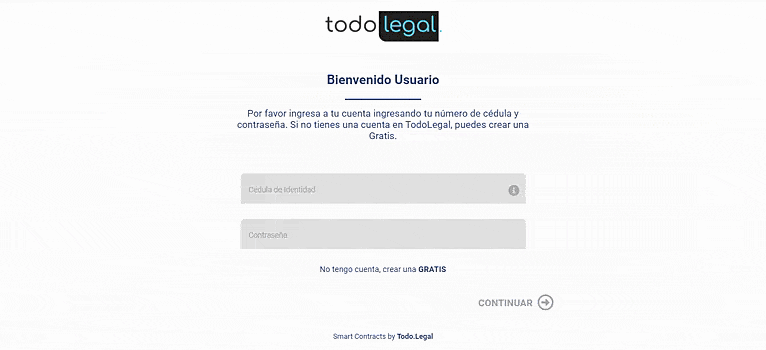
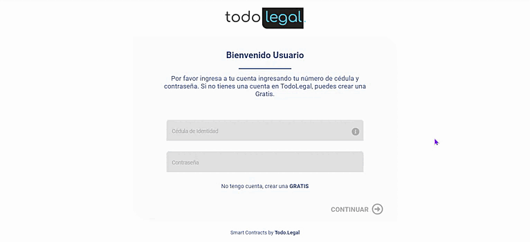

# todo-legal-technical-test

This template should help get you started developing with Vue 3 in Vite.

# Demo




# Screenshots

- Login Screen


- Register Screen


- Home Screen


## Recommended IDE Setup

[VSCode](https://code.visualstudio.com/)

+ [Volar](https://marketplace.visualstudio.com/items?itemName=johnsoncodehk.volar) (and disable Vetur)
+ [TypeScript Vue Plugin (Volar)](https://marketplace.visualstudio.com/items?itemName=johnsoncodehk.vscode-typescript-vue-plugin)
  .

## Customize configuration

See [Vite Configuration Reference](https://vitejs.dev/config/).

## Project Setup

```sh
npm install
```

### Compile and Hot-Reload for Development

```sh
npm run dev
```

### Compile and Minify for Production

```sh
npm run build
```

### Lint with [ESLint](https://eslint.org/)

```sh
npm run lint
```
